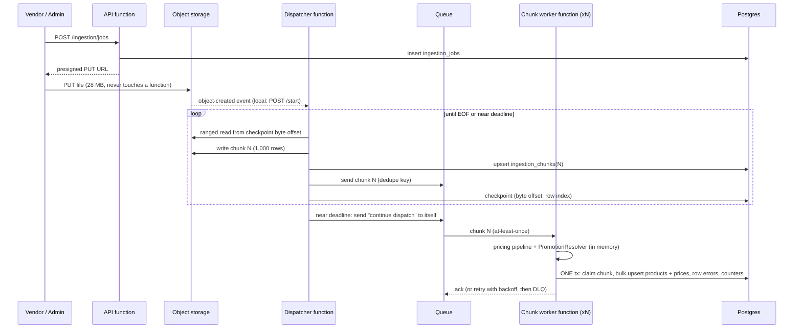
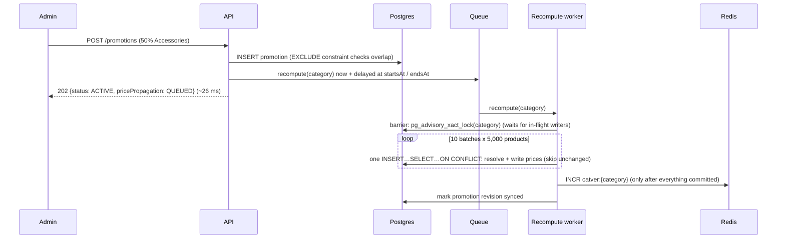
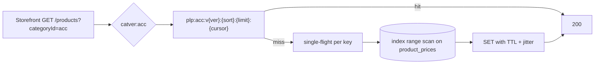

# ADR — ModaCo Promotion Management API

**Status:** Accepted · **Date:** 2026-09-28

This document records the architectural decisions behind the two scalability scenarios,
why they were made, what they cost, and what was rejected.

---

## 1. Core decision: prices are precomputed, promotions are the control plane

ModaCo's hottest reads (`GET /products/:id`, the storefront listing) need the **effective
price**, and the listing must be **sorted by it**. Computing it at read time means joining
products to promotions and evaluating precedence per row, and sorting by a computed
expression. No index can serve that, so every storefront page would scan the category.

**Decision.** Maintain a read model, `product_prices(product_id, category_id,
base_price_minor, effective_price_minor, promotion_id, valid_until)`, with the index
`(category_id, effective_price_minor, product_id)`. Promotions are written as small
control-plane rows. Workers turn promotion changes into price rows.

- `category_id` is denormalized into `product_prices` so the listing query
  (`WHERE category_id = ? ORDER BY effective_price_minor, product_id LIMIT n`) is a single
  index range scan with no join before the limit.
- `product_prices` is **derived state**. Only the pricing module writes it: the resolver
  path and the set-based recompute. API handlers never write it directly.

**Trade-off.** We accept a short propagation delay after a category-wide change (measured:
~1.7 s for 50k products) in exchange for O(log n) reads at any traffic level. Section 3
covers how the delay is bounded and made visible.

### Conflict resolution (the "at most one active promotion" rule)

| Rule | Where it lives | Why there |
|---|---|---|
| Two live promotions on the **same target** may not overlap in time | Postgres `EXCLUDE USING gist (target WITH =, tstzrange(starts_at, ends_at) WITH &&) WHERE cancelled_at IS NULL` | An application-level "check then insert" races under concurrent admin requests. The constraint cannot be bypassed. Violations become `409 PROMOTION_OVERLAP`. |
| **Product-scoped beats category-scoped** | `PromotionResolver` (pure TS) and its SQL mirror | This is a precedence rule, not an invariant: a product can legitimately have a category promotion and a product promotion at once. |
| Status (`SCHEDULED/ACTIVE/EXPIRED/CANCELLED/DRAFT`) | **Derived** from `starts_at/ends_at/cancelled_at`, never stored | A stored status silently goes stale when a date passes. Nothing flips it at midnight. |

Together these guarantee that at any instant each product has at most one applicable
promotion per scope, and the resolver picks exactly one winner.

**Trade-off.** Rejecting overlap is strict: marketing cannot pre-load a "Black Friday 40%"
over an existing "Autumn 20%" on the same category without shortening the first one. The
alternative ("best price wins") was rejected because it hides configuration mistakes and
makes margin exposure hard to reason about.

### Two implementations of the pricing rule, kept honest

The resolver exists twice: in TypeScript (single products, ingestion) and in SQL (bulk
recompute). Duplicated logic can drift, so `tests/integration/pricing-parity.test.ts`
generates random catalogs and promotion calendars and asserts both produce identical
`(effective_price, promotion_id, valid_until)` at 19 different instants. Money is
integer minor units everywhere. Percentages are basis points, rounded half-up, floored at 0.

---

## 2. Scenario A — 500k-row vendor ingestion on a serverless consumption plan

### Constraints restated as design rules

| Constraint | Rule it forces |
|---|---|
| Strict timeout (minutes) | No invocation may be proportional to file size. Work is split into units that each finish in seconds, and any unbounded loop must be able to **checkpoint and continue**. |
| Restricted memory | Never hold the file. Stream with ranged reads. Hold at most **one chunk** at a time. |
| Stateless, dies when the response ends | All progress lives outside the process: object storage, queue messages, Postgres. Nothing runs "in the background" after an HTTP response. |
| Every row through app-layer pricing rules | No `COPY`/bulk-load bypass. Rules run in the worker, in memory, per chunk. |

### Flow

### Decisions

1. **Upload bypasses compute.** The client gets a presigned URL and uploads straight to
   object storage. Pushing 28 MB+ through a function body would hit request-size limits
   (e.g. Lambda's 6 MB) and burn the timeout on network I/O. Locally a signed `PUT` route
   streams to disk as a stand-in.
2. **Streaming dispatcher with record-boundary checkpoints.** The dispatcher streams the
   object from a byte offset (`Range:` read), parses CSV incrementally, and emits a chunk
   every 1,000 records. After each chunk it checkpoints `csv-parse`'s `info.bytes`, the
   byte offset just past the last record. It was verified to be correct across quoted
   newlines, multibyte UTF-8 and a BOM. Slicing raw bytes, the naive approach, would cut
   records in half. The CSV header is persisted on the job, because a resumed read starts
   mid-file.
3. **Self-continuation.** When `remainingMs < safety margin`, the dispatcher saves its
   checkpoint, enqueues a "continue" message to itself and returns. In the demo run with a
   20 s timeout, the 500k-row file took 3 dispatcher invocations.
4. **Chunks are the unit of work, retry and failure.** A worker handles ≤ 1,000 rows, a
   couple of hundred milliseconds of work, far inside any timeout. Chunk payloads live in
   object storage and the queue message carries only `{jobId, chunkIndex}`, which keeps it
   well below queue message-size limits (SQS allows 256 KB).
5. **Idempotency under at-least-once delivery**, at three levels:
   - Chunk boundaries are a pure function of row index (`index = row / chunkSize`), so a
     re-run dispatcher re-emits *identical* chunks. Chunk rows are insert-if-absent and
     queue sends are deduplicated.
   - The worker's transaction starts with `UPDATE ingestion_chunks SET status='DONE' WHERE
     status='PENDING'`. The claim, the product and price upserts, the row errors and the
     job counters **commit or roll back together**. A redelivery either finds `DONE` and
     no-ops, or redoes the whole chunk, never half of it. A test fires three concurrent
     deliveries of one chunk: exactly one commits.
   - Products upsert on `sku` (`INSERT … ON CONFLICT (sku) DO UPDATE`), so re-ingesting a
     file updates in place.
6. **Set-based writes.** Each chunk writes products and prices with one `unnest(...)`
   statement each, instead of 1,000 ORM round-trips. Active promotions for the chunk's
   products and categories are loaded **once**, and all rows are resolved in memory.
7. **Failure isolation.**
   - Invalid rows are recorded in `ingestion_row_errors` with a reason and never fail the
     chunk.
   - A chunk that keeps throwing is retried with exponential backoff, then dead-lettered:
     marked `FAILED` with its last error and surfaced on `GET /ingestion/jobs/:id`.
   - The rest of the file continues. `POST /retry-failed` re-drives dead-lettered chunks
     once the cause is fixed.
8. **Ingestion meets flash sales.** Chunk workers hold the same per-category shared lock
   as product creation (see §3), so ingested products in a category with a live sale are
   discounted on write. In the 500k run, 0 ingested Accessories products missed the
   running flash sale.

### Cloud mapping (the code is cloud-agnostic; ports + adapters)

| Port | AWS | Azure | Local |
|---|---|---|---|
| `BlobStore` | S3 (presigned PUT, ranged GET) | Blob Storage (SAS URL) | disk + HMAC-signed URL |
| `MessageQueue` | SQS + DLQ | Storage Queue / Service Bus | BullMQ |
| trigger for dispatcher | S3 ObjectCreated → Lambda | Event Grid → Function | `POST /start` |
| chunk worker | SQS-triggered Lambda | Queue-triggered Function | BullMQ `Worker` + hard-timeout wrapper |
| sweeper | EventBridge schedule | Timer trigger | BullMQ job scheduler |

Functions have the signature `(event, deps, ctx{deadline}) => result`, so an adapter per
platform is a few lines.

### Trade-offs / known limits

- **Duplicate SKUs across chunks** of the same file are processed in parallel, so the last
  commit wins, not the last row. Within a chunk, the last row wins deterministically. The
  fix, if needed, is a `source_row` guard column (`ON CONFLICT … WHERE products.source_row
  < EXCLUDED.source_row`). It wasn't needed for weekly full-catalog files.
- **Job counters on one row** serialize chunk commits briefly. That's fine at 500 chunks
  and ~4–16 workers. At much higher fan-out, derive progress from `ingestion_chunks` or
  shard the counters.
- **Chunk payloads double the storage writes** (file + chunks). This buys small queue
  messages and the ability to retry a chunk without re-reading the file.
- **Postgres is the ceiling**, not compute. Serverless fan-out must be capped (reserved
  concurrency / worker concurrency) so N workers don't exhaust connections. Use a pooler
  such as RDS Proxy or PgBouncer.

---

## 3. Scenario B — Flash sales under heavy simultaneous read/write

### Write path

- **Admin write is O(1).** Creating a promotion that affects 50,000 products inserts one
  row. The request never touches product rows.
- **Set-based recompute in keyset batches.** One SQL statement per 5,000 products resolves
  the winning promotion (product scope beats category scope) via `LATERAL`, computes the
  price, and upserts. It skips rows whose values didn't change (`IS DISTINCT FROM`), which
  avoids pointless WAL, bloat and cache churn. Batching keeps each statement's row locks
  short, so concurrent writers in the category aren't blocked for the whole recompute.
- **Measured:** 50,000 prices in ~1.7 s end to end.

### Read path

- **Versioned namespaces instead of deletes.** Every listing key embeds its category's
  version. After a recompute commits, one `INCR` retires every cached page of that
  category in O(1). Nothing is enumerated or deleted, and old entries expire on TTL.
  Other categories are untouched.
- **Bump after commit, read version before the database.** If a bump could land before
  the recompute commits, a reader could refill the new version with old prices. Reading
  the version *before* the DB query means a result read just before a bump is filed under
  the old version and never served again.
- **`GET /products/:id` is stamped, not just keyed.** The product-detail entry is keyed by
  product id but carries the category version and the price's `valid_until`. A category
  flash sale never touches that key, but the version mismatch turns it into a miss. This
  closes the hole where the busiest endpoint keeps serving pre-sale prices.
- **Stampede protection.** A version bump makes every cached page of a hot category miss
  at the same instant, mid-flash-sale. In-process single-flight collapses concurrent
  misses for a key into one query. TTL jitter spreads expiries.
- **Fail-open.** If Redis is unavailable, reads go to Postgres (versions return a sentinel
  that disables caching) rather than erroring.
- **Keyset pagination** on `(effective_price_minor, product_id)`. Deep pages cost the same
  as page 1, and pages don't skip or duplicate items when prices change mid-browse, which
  `OFFSET` does during a flash sale.

### "A new product added during the sale must get the discount"

Product creation and ingestion price the product **in the same transaction as the
insert**, using the same resolver. So a product created while the sale is live is
discounted on its first read. No polling, no special case.

The subtle part is the **race** with a sale being created at the same moment:

1. Transaction P inserts a product and resolves its price: there's no sale yet, so full
   price. P hasn't committed yet.
2. The sale commits, and the recompute scans the category. P's row is invisible, so it's
   skipped.
3. P commits at full price and stays there until the sale ends.

**Fix:**
- Product writers hold `pg_advisory_xact_lock_shared(category)` and read promotions only
  after acquiring it.
- The recompute first takes the exclusive lock as a **barrier**: it waits for every writer
  that started before the sale existed. Writers that start after the barrier already see
  the sale.
- Writers never block each other.
- `flash-sale.test.ts` reproduces the interleaving deterministically. Without the barrier
  the product stays at 1000; with it, 500. The test was verified to fail with the lock
  removed.
- The barrier only covers **new** products. Writers that start after it (the next
  ingestion chunk re-pricing an existing SKU) run alongside the recompute batches. The
  recompute is one `INSERT … SELECT … ON CONFLICT DO UPDATE` that prices from its
  start-of-statement snapshot. It would wait on the writer's price row, then overwrite it
  with the **old** base price. Product-scoped promotions take no barrier at all, so a
  writer that resolved its price before the promotion existed could overwrite it. The
  promotion was already marked synced, so reconcile would never repair it. **Fix:** the
  recompute locks product rows `FOR SHARE` in id order. It waits for an in-flight writer
  and re-reads the latest row. A writer that arrives later waits for the recompute, then
  sees the promotion, because writers upsert the product row *before* loading promotions.
  Two deterministic tests in `flash-sale.test.ts` cover this. Both fail without the lock.

### Time-driven transitions (a sale must also *end*)

Precomputed prices are correct only until a promotion starts or ends. Three layers handle
this:

1. **Delayed messages** at each category promotion's `startsAt` and `endsAt` trigger a
   recompute at the exact instant.
2. **`valid_until` on every price row**: the earliest moment its answer could change. The
   minute sweeper recomputes rows where `valid_until <= now()` (an index-backed query). It
   is the safety net if a delayed message is lost.
3. **Read-side guard.** `GET /products/:id` treats a row past its `valid_until` as stale.
   It recomputes that single row before responding, so the detail page is never wrong,
   even in the seconds before the sweeper runs.

### Reliability: commit-then-enqueue

The promotion row commits, then the recompute message is sent. If the send fails (broker
down, process killed between the two), the sale would be committed but never applied.
Promotions carry `pricing_rev` (bumped on every change) and `pricing_synced_rev` (set by a
finished recompute). The sweeper re-drives any promotion where `synced < rev` after a grace
period. The admin sees `pricePropagation: DEFERRED` instead of an error. This is a
lightweight transactional outbox. It's covered by a test with the queue failing.

### Trade-offs

- **Staleness window.** For ~1–3 s after a category promotion is created or cancelled,
  listings show the previous prices. The response says `QUEUED` so the admin UI can show
  "propagating". For a flash sale that runs for hours this is acceptable. For a legal
  price-display requirement it would need a read-time overlay.
- **Write amplification.** A 50k-product sale writes 50k rows. At much larger scale (5M
  products per category) we would switch the category-scope case to a read-time overlay.
  That uses a small `active_category_promotion` lookup and, because a single percentage
  discount preserves order, can still sort on `base_price`. Product-level overrides would
  be merged. More complex; not needed at 50k.
- **Two implementations of pricing** (TS + SQL), mitigated by the parity test.
- **Catalog writes invalidate listings.** Every product create and every ingestion chunk
  bumps its category's cache version and the global one. Under sustained writes (a vendor
  sync during a flash sale), the listing hit ratio for those categories drops and more
  reads reach Postgres. Next step: coalesce catalog-driven bumps. Mark categories dirty
  in Redis and let the sweeper bump each at most once per interval, which bounds
  staleness at about a minute. Promotion changes would keep bumping immediately, because
  price correctness matters more there.
- **Product-scoped wins even when it's the smaller discount.** A product with its own 5%
  promotion does not get a 50% category flash sale. This is intentional: an explicit
  per-product decision outranks a blanket rule, and the outcome is predictable. If the
  business prefers "best price for the customer", only the resolver's precedence
  function and its SQL mirror change.
- **In-process single-flight** only coalesces within one instance. With N API instances,
  up to N concurrent loads per key hit Postgres. Next step: a short Redis lock or
  stale-while-revalidate.

### Alternatives rejected

| Alternative | Why not |
|---|---|
| Compute effective price at read time (join + CASE) | Sorting by effective price can't use an index. Every storefront page scans the category, the worst possible profile during a flash-sale read spike. |
| Recompute synchronously inside `POST /promotions` | 50k rows inside an HTTP request: long transaction, lock contention with storefront-driven writes, request timeouts. |
| Row-by-row ORM loop in a worker | 50k round-trips (~tens of seconds) versus 10 statements. |
| Postgres materialized view + `REFRESH` | Refreshes the whole view (all categories) for a one-category change. `CONCURRENTLY` needs a full rebuild plus diff. |
| Delete cache keys per product on promotion change | Needs enumerating 50k keys, and races with concurrent refills. Versioned namespaces are O(1) and race-safe. |
| Stored `status` column + cron flipping it | Stale between cron ticks, and still doesn't reprice anything. Status is derived instead. |

---

## 4. Smaller decisions

- **PostgreSQL + Prisma, raw SQL where it matters.** Prisma for simple CRUD and types.
  Hand-written SQL for the hot/bulk paths (keyset listing, `unnest` upserts, `LATERAL`
  recompute) and for the migration: Prisma can't express `EXCLUDE`, partial indexes or
  `CHECK` constraints, so `prisma/migrations/*.sql` is the source of truth.
- **Integer minor units** for money (int4 ≈ 21M TRY per item, ample for fashion). No floats.
- **Express 5**: async errors propagate to one error handler. It maps `23P01` → 409,
  `23505` → 409, and FK violations → 422.

## 5. Next steps (out of scope for the case)

- AuthN/Z: admin-only promotion and ingestion endpoints, audit log of who changed prices.
- Distributed single-flight / stale-while-revalidate. CDN caching of listing pages keyed
  on the category version.
- Observability: metrics for propagation lag (promotion created → synced), sweeper
  backlog, DLQ depth, cache hit ratio.
- Connection pooling for fan-out workers (RDS Proxy / PgBouncer). Read replicas for
  cache misses.
- A true outbox table (for multi-event workflows) if more side effects hang off promotion
  changes.
